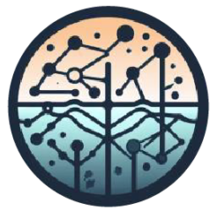
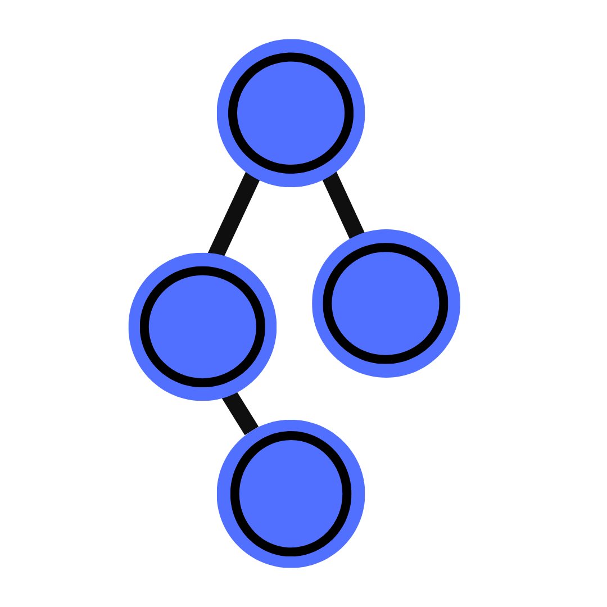
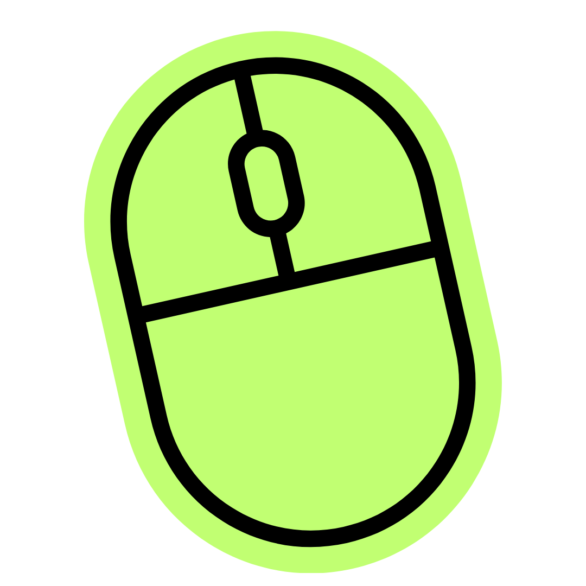

##  About Me

&nbsp;&nbsp; Mexican-British girl from Cancún, Mexico
 
&nbsp;&nbsp; Studying Computer Science and Data Science with a Graphic Design certificate @ UW-Madison
 

##  Currently a part of...

&nbsp;&nbsp; [The Center for High Throughput Computing](https://chtc.cs.wisc.edu) where I work on a facilitation project called `Bytes of Knowledge` improving research computing documentation
 
&nbsp;&nbsp; [Software Training for Students](https://sts.doit.wisc.edu) where I work as a Student Software Trainer helping students with web development, programming, and design software
 
&nbsp;&nbsp; [Solis-Lemus Lab](https://sts.doit.wisc.edu) working on my project `GOF Network Models to Microbiome` where I develop and analyze goodness-of-fit network models for microbiome systems
 

##   My Projects

| Name | Description |
|---|---|
|  [gof-microbiome-networks](https://github.com/solislemuslab/gof-microbiome-networks) | Exploring the goodness of fit of mathematical network models applied to microbiome systems |
| [personal-website](https://github.com/daniellawright/personal-website) | My personal website to showcase experience/projects/achievements |
