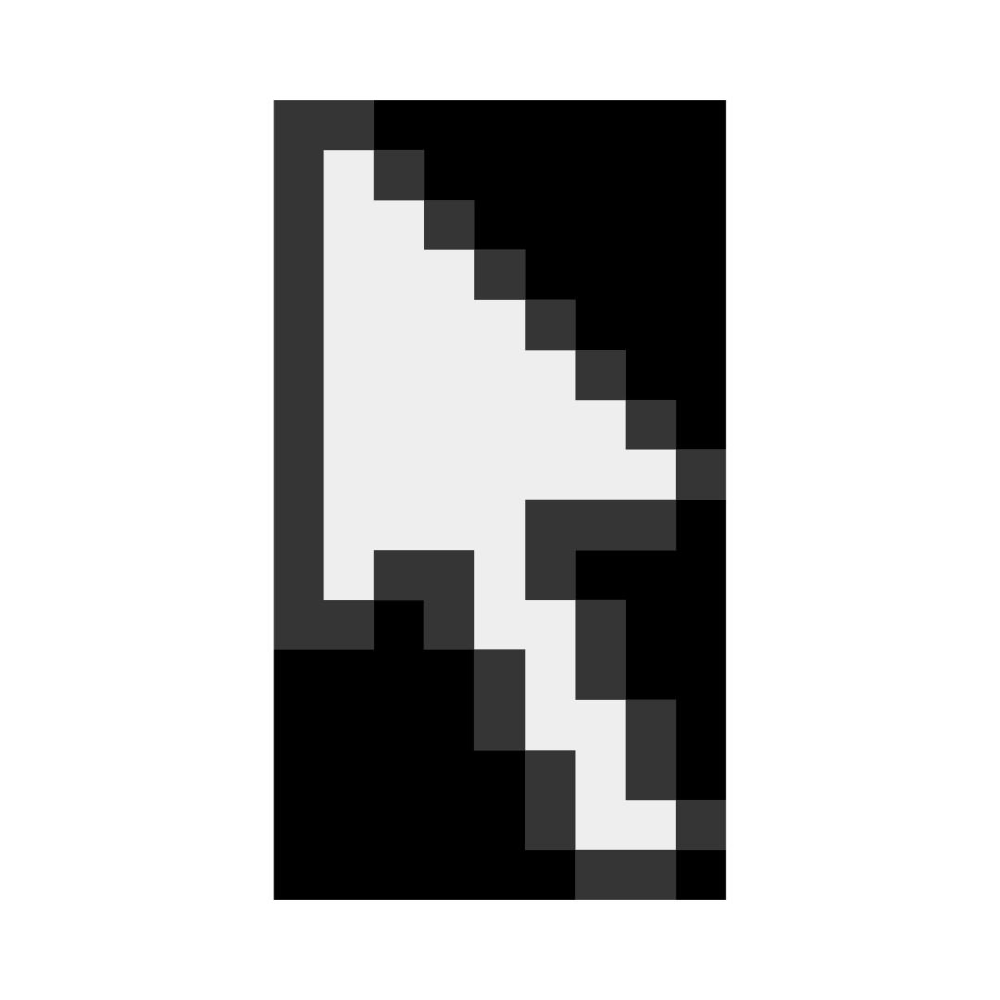
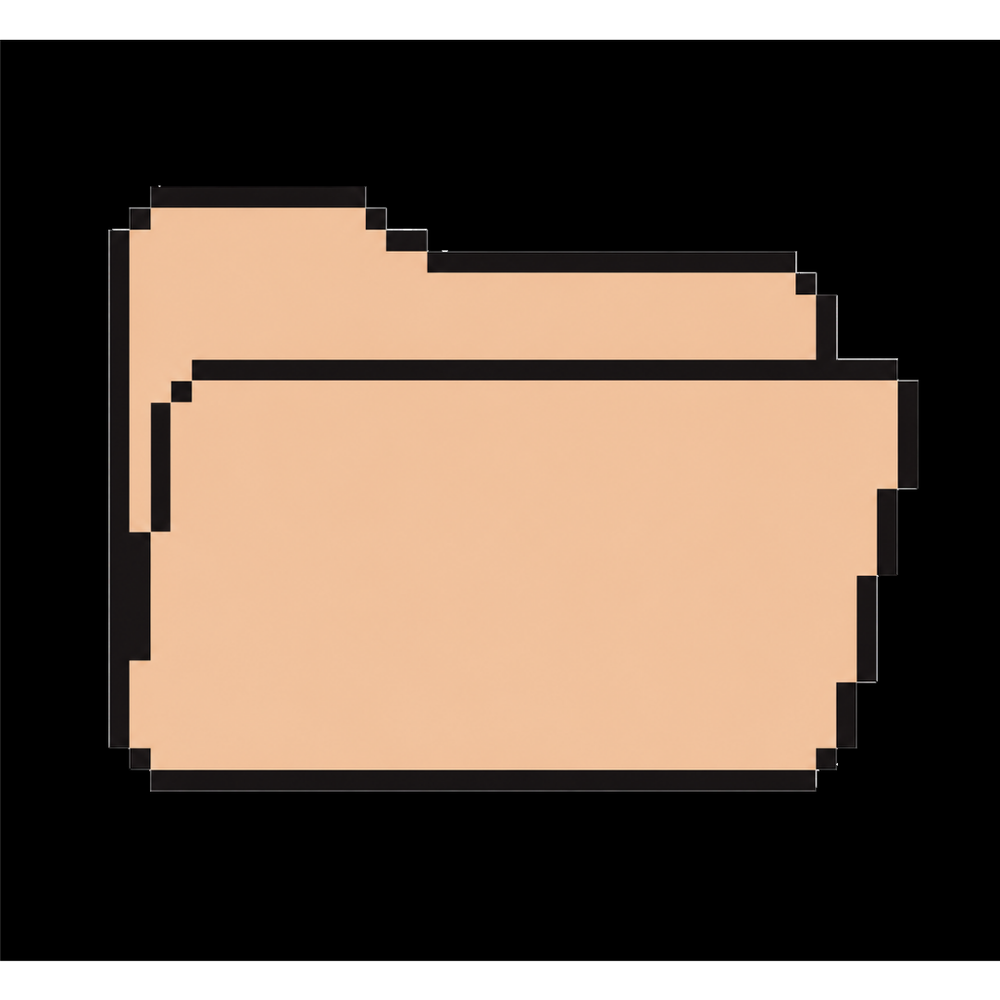
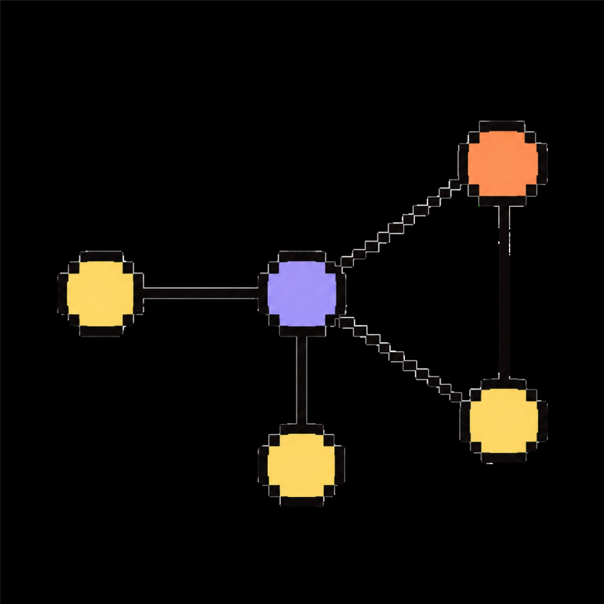

##  about me

&nbsp;&nbsp; mexican-british girl from cancun, mexico
 
&nbsp;&nbsp; studying computer science and data science with a graphic design certificate @ uw-madison
 

##   my projects

| name | description |
|---|---|
|  [gof-microbiome-networks](https://github.com/solislemuslab/gof-microbiome-networks) | exploring the goodness of fit of mathematical network models to microbiome systems |
| [personal-website](https://github.com/daniellawright/personal-website) | my personal website to showcase experience/projects/achievements |
